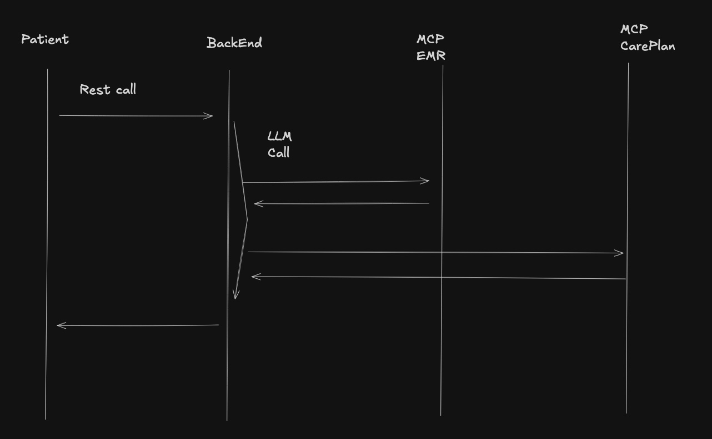

# Care Plan Request and Response Format

## Request Schema

```json
{
  "firstName": "String",
  "lastName": "String",
  "age": "Number",
  "malePartner": "Boolean",
  "malePartnerAge": "Number | null",
  "malePartnerMarried": "Boolean | null",
  "malePartnerSemenAnalysis": "String | null",
  "symptom": "String",
  "bmi": "Number",
  "fsh": "Number",
  "amh": "Number",
  "previousIvf": "Boolean",
  "insurerName": "String",
  "policyNumber": "Number",
  "budget": "Number"
}
```

Partner-related fields are nullable because they are only required when `malePartner` is `true`.

## Example Request JSON

```json
{
  "firstName": "Anna",
  "lastName": "Meyer",
  "age": 34,
  "malePartner": true,
  "malePartnerAge": 36,
  "malePartnerMarried": true,
  "malePartnerSemenAnalysis": "JVBERi0xLjQKJcTl8uXrp...",
  "symptom": "Irregular cycle",
  "bmi": 23.4,
  "fsh": 7.8,
  "amh": 2.1,
  "previousIvf": false,
  "insurerName": "HealthCare Plus",
  "policyNumber": 123456789,
  "budget": 5000
}
```

## Response Schema

The endpoint returns a care plan as an array containing one or more care plan objects.

```json
[
  {
    "journeyGoal": "String",
    "journeySummary": "String",
    "workflowSummary": "String",
    "timelineSummary": "String",
    "summary": "Number"
  }
]
```

## Example Response JSON

```json
[
  {
    "journeyGoal": "Achieve a successful fertility treatment outcome based on the patient's medical profile and available budget.",
    "journeySummary": "The patient will start with a fertility specialist consultation, followed by diagnostic checks and an individualized treatment recommendation.",
    "workflowSummary": "The workflow includes medical review, hormone value assessment, partner-related analysis if applicable, insurance validation, and care plan creation.",
    "timelineSummary": "The initial assessment and diagnostics are expected within the first two weeks, followed by treatment planning in week three.",
    "costSummary": 190719
  }
]
```

## Field Notes

- `malePartnerSemenAnalysis` contains the file content as a Base64-encoded string.
- Numeric medical values such as `bmi`, `fsh`, and `amh` may contain decimal values.
- `policyNumber` is represented as a number in this format.
- The response is always an array, even if only one care plan is returned.

## Workflow Steps




## Endpoint

POST http://localhost:59773/csp/demo/vif
